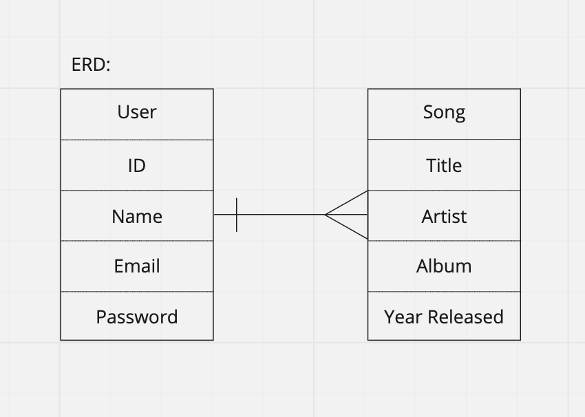

# myTunes

## **Intro**
This is my myTunes front-end application.

**Templates**
- [React Template] (https://git.generalassemb.ly/ga-wdi-boston/react-auth-template)
- [API Template] (https://git.generalassemb.ly/ga-wdi-boston/express-api-template)

**ERD**

---
  

**WireFrames**

---
  

**User Stories**
- A user will be able to sign up if a new user.
- A user will be able to sign in if an existing user.
- A user will be able to change password.
- A user will be able to sign out.
- A user will be able to upload a song via Youtube/SoundCloud links.
- A user will be able to play the uploaded songs on a web music player.
- A user will be able to display all their songs on the music player.
- A user will be able to delete songs.

**Technologies Used**
- HTML5
- CSS3
- JavaScript
- React.js
- Express.js
- Handlebars
- Bootstrap
- MongoDB
- Heroku
- Github

## Tasks

Developers should run these often!

- `npm run nag`: runs code quality analysis tools on your code and complains.
- `npm run make-standard`: reformats all your code in the JavaScript Standard
  Style.
- `npm run start`: generates bundles, watches, and livereloads.
- `npm run build`: place bundled styles and scripts where `index.html` can find
    them
- `npm run deploy`: builds and deploys master branch

## [License](LICENSE)

1. All content is licensed under a CC­BY­NC­SA 4.0 license.
1. All software code is licensed under GNU GPLv3. For commercial use or
    alternative licensing, please contact legal@ga.co.
