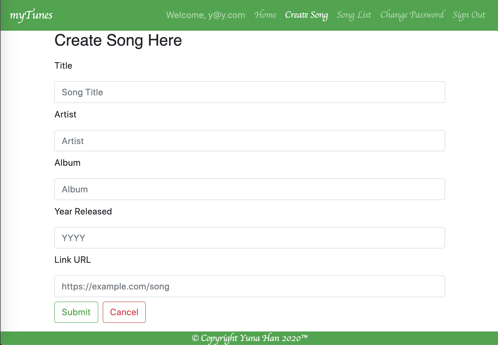
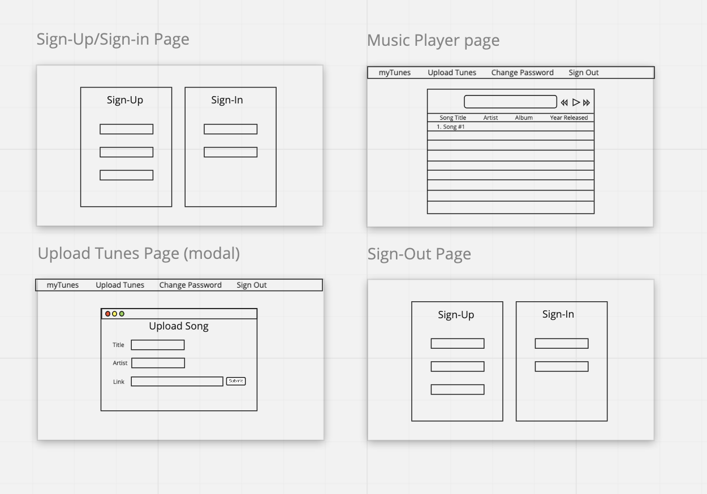

# myTunes

## **Intro**
This is my myTunes front-end application.

## **Application Screenshots**
___

## **Backstory**
I have always been facinated with music and how much music streaming platforms have changed so drastically in the past 2 decades. I remember listening to music on the vinyl when I was very young, and then on tape cassettes and CD players. I also remember clearly when portable players such as ipods came out like it was yesterday. When the internet became popular, I also jumped on the digital bandwagon and later on, when I was 17, I also became interested in building my own websites and have always looked for ways to add a music player to my page. This was no exception. I know this is what I'm passionate about and that's why I'm building my very own music app.

## **Templates**
- [React Template](https://git.generalassemb.ly/ga-wdi-boston/react-auth-template)
- [API Template](https://git.generalassemb.ly/ga-wdi-boston/express-api-template)

## **Planning**
Day 1: I started by setting up the Express API template and the React Auth Template. After the initial commit is done and both server and client are deployed, I proceeded to the API template and added model & routes for my song resource, and also completed CRUD on the api using Postman.

Day 2: On the client side, I began adding Component & routes to Song with these files: Songs, Song, CreateSong & EditSong. Also wrote all the necessary axios calls to the API. I was able to complete most of the CRUD by the end of the day but with EditSong & Delete still in progress.

Day 3: I continued to work on EditSong and Delete and finished CRUD on the client side by midday. I then added a new Song component called SongPlayer where I can stream the song when a user clicks on the song link.

Day 4: I had a bit of a setback because getting a song to play on clicking the song link proves to be a bit of a challenge. With some help though, I was able to complete the task. I then started doing some CSS styling and updating the README. Finishing up the project.

UPDATE 4/8/2020: I ran into a user-facing bug so I changed the app to have the embedded video player render automatically when the user clicks on the song in the songList for more info. Use will still have to click the play button on the video player to listen to the song.

## **User Stories**
- A user will be able to sign up if a new user.
- A user will be able to sign in if an existing user.
- A user will be able to change password.
- A user will be able to sign out.
- A user will be able to create a list of songs with the song title, artist & the song URL from any source of their choice.
- A user will be able to display all their songs on their Song List.
- A user will be able to view the song info upon clicking on the song link.
- A user will be able to edit their song via a form-field.
- A user will be able to delete songs.
- A user will be able to play the songs via embedded video player when they click on the song.

## **Technologies Used**
Front-End Client
- HTML5
- CSS3
- JavaScript
- Axios
- Bootstrap
- React.js

Back-End API
- Express.js
- Postman
- MongoDB
- Heroku
- Github

## **Unsolved Problems**
- Code Refactoring.
- I would like to have user be able to add their favorite songs to their playlist.
- I would like to have the player to play the playlist with or without loop options.
- I would like to have the player to play music continuously when you navigate the site.

## Repos & Deployed Sites

- [Client Repo](https://github.com/YunaHan53/myTunes-client)
- [Deployed Client](https://yunahan53.github.io/myTunes-client/)
- [API Repo](https://github.com/YunaHan53/myTunes-api)
- [Deployed API](https://aqueous-temple-54494.herokuapp.com/)

## Setup Instructions

- Fork and clone this repository and the [Backend Repo](https://github.com/YunaHan53/myTunes-api)
- Navigate to this repository using the command line
- Run `npm install` to install dependencies
- Run `npm install react-player`:[ReactPlayer](https://github.com/CookPete/react-player)
- Run `npm run start`: to run local host: generates bundles, watches, and livereloads.
- `npm run deploy`: builds and deploys master branch

## **WireFrames**
___

  

## [License](LICENSE)

1. All content is licensed under a CC­BY­NC­SA 4.0 license.
1. All software code is licensed under GNU GPLv3. For commercial use or
    alternative licensing, please contact legal@ga.co.
